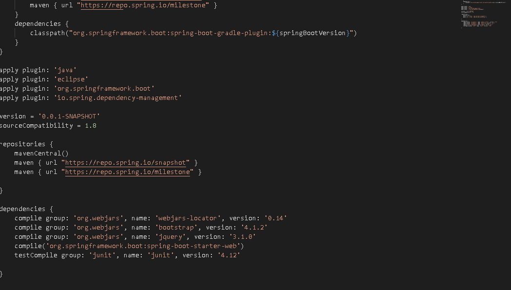
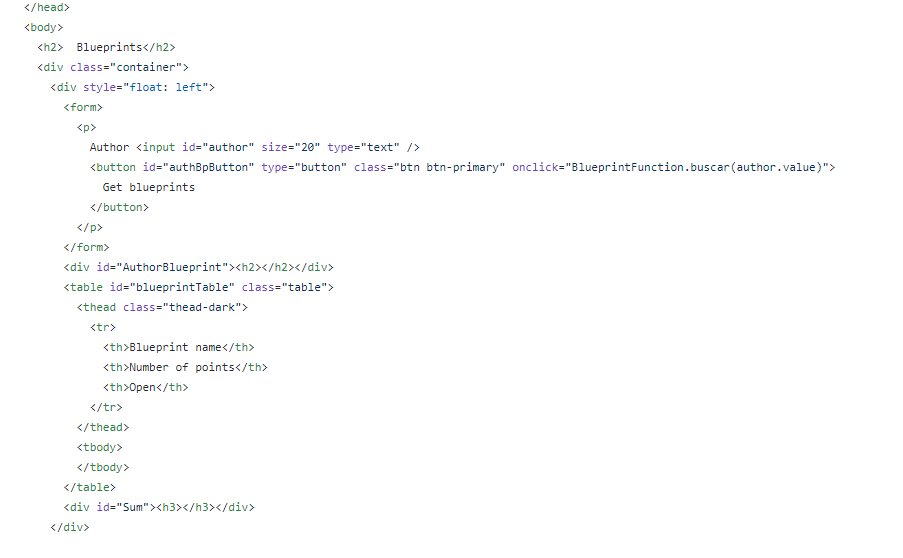
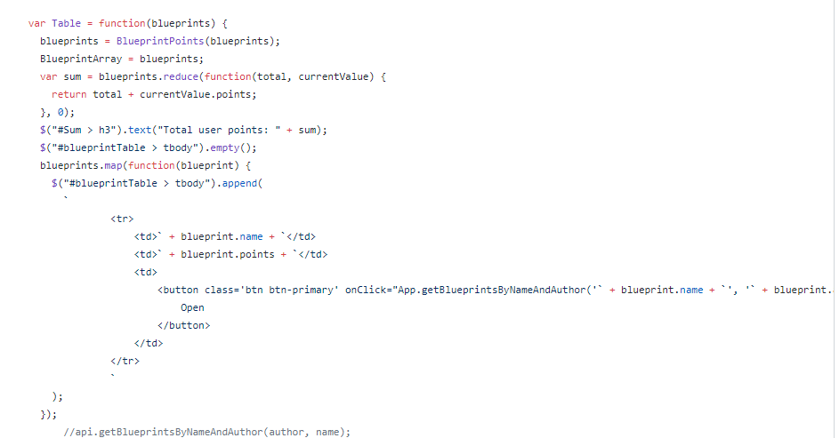
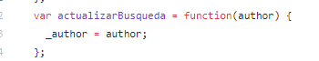

# Lab5Arsw

# Autores:
* Andres Rodriguez del toro
* Nicolas Patiño
---
# description:

we make this page in order to respond show the blueprints that one author created and for each blueprint we show the respective points of them.
in the bottom we show the total points that the author have. 
#

 this is the configuration that we use in the gradle.build
 

#
 ##Front-end
 
 
 
 ##Back-end
 
 
 #
When developing this project, we found some problems, the most important was when the user makes an entry to search, the application does not respond, we discovered that it was because he was not updating the search.

 
